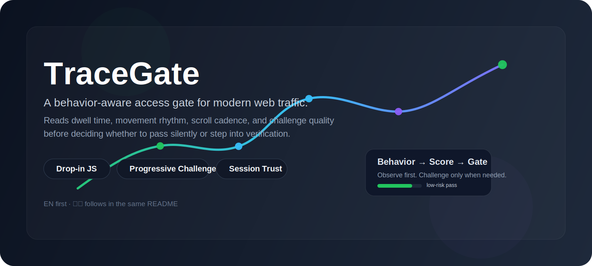
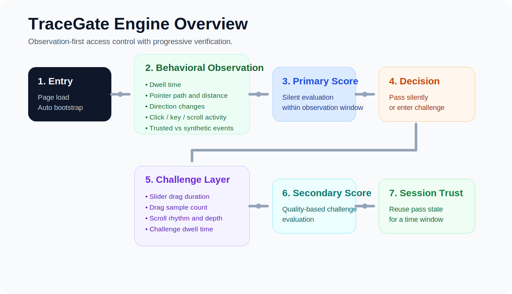
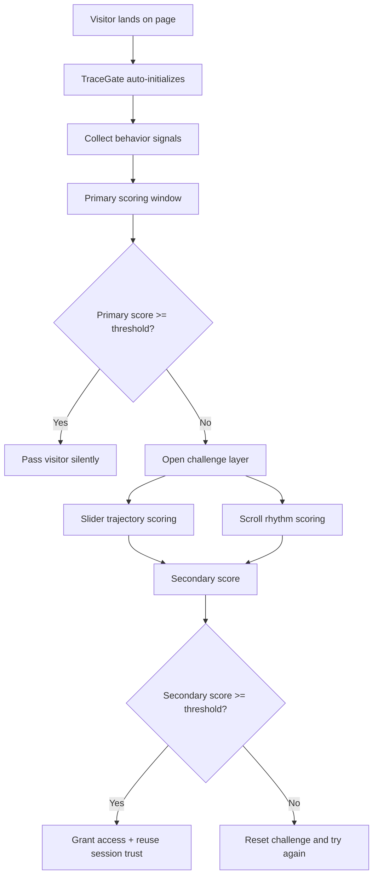
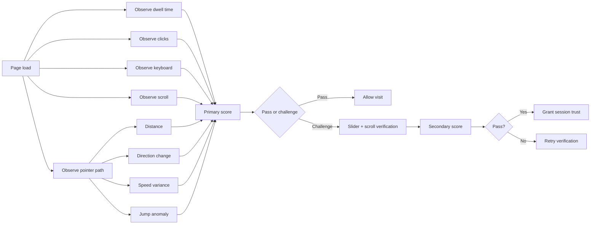
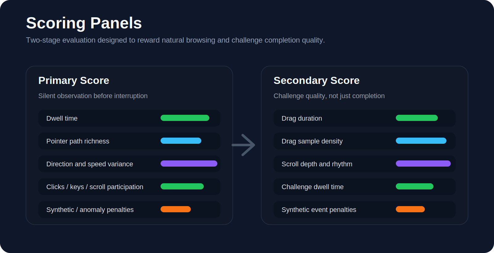
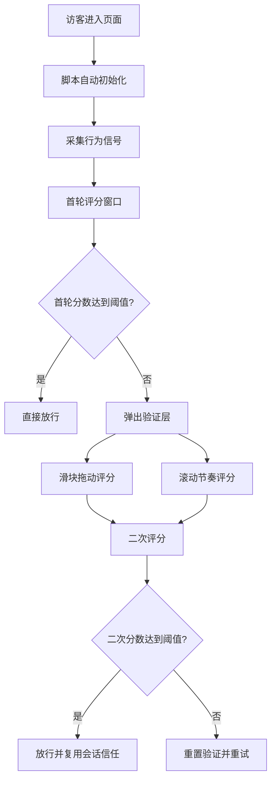
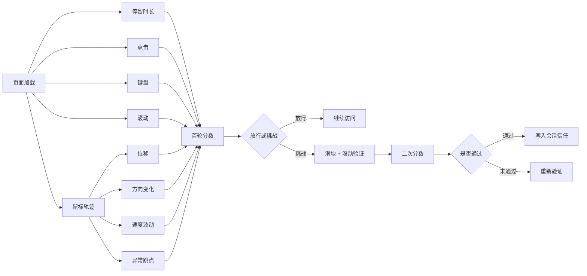

# TraceGate

<p align="center">
  
</p>

<p align="center">
  <a href="#"></a>
  <a href="#"></a>
  <a href="#"></a>
  <a href="#"></a>
</p>

<p align="center">
  A behavior-aware access gate for the web. It watches how a visit moves, pauses, scrolls, and interacts before deciding whether to pass silently or step into a challenge.
</p>

---

## ENGLISH

### Why TraceGate feels different

Most browser-side verification starts with a challenge. TraceGate starts with observation.

Instead of interrupting every visitor at the door, it opens with a short behavioral read: dwell time, pointer movement, click rhythm, scroll cadence, direction changes, velocity variance, trusted events, and challenge completion quality. Natural traffic gets a smoother path. High-risk traffic gets a second look.

That shift matters.

It lowers friction for real users, keeps integration light for engineering teams, and gives risk systems more than a single slider result to work with.

### What it is

TraceGate is a drop-in front-end behavior guard designed for pages that need a lighter, smarter first layer of bot resistance.

Add one script. No explicit bootstrap call. No business-method wiring. The script auto-starts on page load, scores the session, and decides between:

- **Pass**
- **Challenge**
- **Challenge + secondary scoring**
- **Session trust reuse**

### Hero points

- **Zero-method integration** — include the script and it boots itself
- **Progressive challenge model** — observe first, challenge later
- **Two-stage scoring** — passive behavior scoring + challenge scoring
- **Session-level trust reuse** — reduce repeated friction
- **Server-ready reporting hook** — optional status handoff to backend risk systems
- **UI-state exposure** — runtime status is reflected on the document root
- **Event-driven extension** — easy to wire into login, search, posting, checkout, and API gates

---

## Visual Overview

<p align="center">
  
</p>

### Traffic lifecycle



### Detailed behavior pipeline



---

## Why teams put this in front of real traffic

### 1. It does not treat everyone like a bot

A lot of verification flows make the same mistake: they front-load friction.

TraceGate starts with a silent read. The verification UI only appears when the session looks weak, thin, or mechanically abnormal.

### 2. It gives the backend something more useful than a single boolean

The optional reporting layer can hand off status changes and scoring context to the backend, making it easier to connect browser-side behavior with:

- login risk control
- search abuse monitoring
- posting throttles
- activity-page defense
- campaign anti-spam
- account takeover friction
- interface-level challenge escalation

### 3. It is lightweight to drop in

The integration model is intentionally simple:

```html
<script>
  window.__ANTI_BOT_CONFIG__ = {
    reportUrl: "/api/anti-bot/report",
    primaryPassScore: 60,
    secondaryPassScore: 55,
    observationWindowMs: 6000,
    sessionTrustMs: 1800000
  };
</script>
<script src="/static/js/anti-bot-guard.js"></script>
```

No manual init step is required.

---

## Runtime model

### Stage 1 — silent observation

On page load, TraceGate begins collecting behavior signals such as:

- dwell time
- pointer movement
- click activity
- keyboard activity
- page scroll
- velocity variance
- directional change
- suspicious jumps
- trusted vs synthetic events

These signals are used to compute a **primary score**.

### Stage 2 — progressive challenge

If the session does not meet the primary threshold within the observation window, TraceGate opens a challenge layer.

The challenge is not just a binary slider check. It looks at:

- drag duration
- drag sample count
- drag completion ratio
- drag reversals
- scroll depth
- scroll rhythm
- challenge dwell time
- synthetic event hints

These signals produce a **secondary score**.

### Stage 3 — session trust reuse

If the challenge is passed, TraceGate marks the session as trusted for a configurable period. During that trust window, the same session can move through without repeated interruption.

---

## Scoring philosophy

<p align="center">
  
</p>

TraceGate is designed around a simple principle:

> **Behavior comes first. Verification is the fallback.**

The scoring model favors sessions that look human in motion, timing, and interaction diversity. It penalizes sessions that look too thin, too flat, too linear, or too synthetic.

Typical positive signals include:

- enough dwell time to establish intent
- non-trivial pointer travel
- reasonable coverage across the viewport
- natural direction change
- speed fluctuation that is not machine-flat
- click or scroll participation
- trusted browser events

Typical negative signals include:

- extremely thin interaction samples
- long linear paths with no natural deviation
- highly uniform timing
- highly uniform movement velocity
- suspicious jump patterns
- synthetic event traces

---

## Configuration

| Key | Type | Purpose |
|---|---|---|
| `reportUrl` | `string` | Optional endpoint for status reporting |
| `primaryPassScore` | `number` | Threshold for silent pass during primary scoring |
| `secondaryPassScore` | `number` | Threshold for challenge pass during secondary scoring |
| `observationWindowMs` | `number` | Time window for initial signal collection |
| `sessionTrustMs` | `number` | Trust reuse duration for the current session |

### Notes

- `reportUrl` is optional.
- Challenge triggering does **not** depend on making a backend call.
- Normal browsing behavior is still observed and scored even without a reporting endpoint.
- Backend integration is recommended when challenge state needs to influence sensitive APIs or business flows.

---

## DOM states and events

### Root attributes

TraceGate writes runtime status to the root element:

```html
<html data-antibot-status="monitoring">
<html data-antibot-status="challenge">
<html data-antibot-status="passed">
<html data-antibot-score="68">
```

### Browser events

TraceGate dispatches these events on `window`:

- `antiBot:status`
- `antiBot:challenge`
- `antiBot:passed`

Example:

```js
window.addEventListener("antiBot:passed", function (event) {
  console.log("passed", event.detail);
});
```

---

## Where it fits well

- login pages
- sign-up pages
- search entry points
- activity and campaign landing pages
- content pages with scraping pressure
- comment / post submission
- request-heavy browse flows
- preflight browser-side risk gating before API submission

---

## Integration modes

### Mode A — page-resident protection

TraceGate begins observing as soon as the page loads. If the score is high enough, the visitor passes. If not, the visitor gets challenged.

Best for:

- content pages
- campaign pages
- search pages
- landing pages

### Mode B — API-driven escalation

The page continuously gathers signals, but the actual challenge is enforced only when a sensitive backend action is requested.

Best for:

- login
- registration
- comment posting
- order creation
- rate-limited operations

The current script implements **Mode A** directly and leaves enough extension space to wire **Mode B** into server-controlled risk workflows.

---

## Recommended repository structure

```text
tracegate/
├── dist/
│   └── anti-bot-guard.js
├── assets/
│   ├── hero-banner.svg
│   ├── engine-overview.svg
│   └── scoring-panels.svg
├── README.md
├── CHANGELOG.md
├── LICENSE
└── package.json
```

---

## Positioning

TraceGate is not presented as a complete anti-automation silver bullet.

It is best understood as a **front-end behavioral gate** that adds an intelligent layer before heavier validation or backend enforcement.

A stronger production posture usually combines it with:

- rate limiting
- backend risk scoring
- token or session validation
- IP / device heuristics
- abuse monitoring
- business-rule enforcement

---

## Roadmap

- custom challenge UIs
- challenge token signing
- backend-driven escalation flows
- richer signal output
- dashboard-oriented tuning
- multiple challenge strategies
- stronger API integration patterns

---

## 中文

### 为什么 TraceGate 看起来不像传统验证码脚本

大多数前端人机验证方案，默认思路都是“先拦一下再说”。

TraceGate 不是这样。

它会先观察当前访问在页面里的真实行为：停留时长、鼠标轨迹、点击节奏、滚动行为、方向变化、速度波动、可信事件，再决定这次访问是直接放行，还是进入验证。

这件事的价值很直接：

- 正常用户不必一上来就被打断
- 接入成本更低，不需要业务代码到处手动调用
- 风控系统拿到的不再只是一个“滑块通过 / 未通过”的结果，而是一组更有上下文的浏览器侧行为信号

### 这是什么

TraceGate 是一个即插即用的前端行为风控脚本，适合放在需要轻量抗爬、轻量防刷、轻量前端风险识别的位置上。

接入方式非常简单：

- 引入一段 JS
- 不需要主动调用初始化方法
- 页面加载后自动开始运行
- 自动评分
- 自动决定是直接放行，还是进入验证

### 一句话理解

**先看行为，再决定要不要挑战。**

---

## 一图看懂

<p align="center">
  
</p>

### 访问流程



### 行为识别链路



---

## 这个项目适合放在什么位置

TraceGate 比较适合做“前端第一道门”，常见位置包括：

- 登录页
- 注册页
- 搜索页
- 内容详情页
- 活动页
- 评论、发帖、提交表单前
- 高频浏览页面
- 敏感接口提交前的浏览器侧预判

---

## 详细流程

### 第一阶段：静默观察

页面加载后，TraceGate 会自动监听这些行为：

- 停留时长
- 鼠标移动轨迹
- 点击次数
- 键盘输入
- 页面滚动
- 速度波动
- 方向变化
- 异常跳点
- 可信事件和非可信事件

这一步的目标不是立刻弹验证，而是先做一次无打扰识别。

如果在观察窗口内，当前访问已经表现出比较自然的浏览行为，那么就直接通过。

### 第二阶段：首轮评分

脚本会根据采集到的行为信号计算首轮分数。

加分方向通常包括：

- 停留时间达到基础阈值
- 鼠标轨迹样本足够
- 轨迹覆盖区域比较自然
- 位移、方向变化合理
- 速度存在自然波动
- 有点击、滚动、键盘等真实交互
- 可信事件比例正常

扣分方向通常包括：

- 行为样本过少
- 桌面端几乎没有鼠标轨迹
- 长距离直线轨迹
- 节奏过于均匀
- 移动速度过于机械
- 异常跳点过多
- 出现非可信事件

### 第三阶段：渐进式验证

如果首轮分数不够，TraceGate 才会弹出验证层。

验证层不是只看“有没有把滑块拖到最右侧”，而是继续看整个完成过程：

- 拖动用了多久
- 拖动轨迹采样是否充足
- 是否存在自然的回拉和修正
- 是否滚动到了底部
- 滚动过程是不是一瞬间完成
- 整体停留时间是否合理
- 是否出现非可信事件

这一步会生成二次分数。

### 第四阶段：会话放行

二次验证通过后，脚本会在当前会话里记录通过状态，在配置的信任窗口内尽量不再重复打扰。

这样做的目的很明确：减少对真实用户的连续打断。

---

## 快速开始

```html
<script>
  window.__ANTI_BOT_CONFIG__ = {
    reportUrl: "/api/anti-bot/report",
    primaryPassScore: 60,
    secondaryPassScore: 55,
    observationWindowMs: 6000,
    sessionTrustMs: 1800000
  };
</script>
<script src="/static/js/anti-bot-guard.js"></script>
```

只要引入脚本，就会自动运行，不需要主动调用任何初始化方法。

---

## 配置说明

| 配置项 | 类型 | 作用 |
|---|---|---|
| `reportUrl` | `string` | 可选的服务端状态上报地址 |
| `primaryPassScore` | `number` | 首轮静默评分通过阈值 |
| `secondaryPassScore` | `number` | 二次验证评分通过阈值 |
| `observationWindowMs` | `number` | 首轮观察窗口时长 |
| `sessionTrustMs` | `number` | 当前会话信任复用时长 |

### 额外说明

- `reportUrl` 不配置也可以正常运行
- 是否弹验证，不依赖接口调用
- 正常浏览本身就会触发行为采集和评分
- 如果要和登录、发帖、下单、搜索这些接口联动，再接服务端会更完整

---

## 运行时状态

TraceGate 会把当前状态写到根节点：

```html
<html data-antibot-status="monitoring">
<html data-antibot-status="challenge">
<html data-antibot-status="passed">
<html data-antibot-score="68">
```

同时会向 `window` 抛出这些事件：

- `antiBot:status`
- `antiBot:challenge`
- `antiBot:passed`

示例：

```js
window.addEventListener("antiBot:passed", function (event) {
  console.log("passed", event.detail);
});
```

---

## 两种接入思路

### 1. 页面驻场型

页面一加载就开始观察和评分，分数不够时自动弹验证。

适合：

- 内容页
- 搜索页
- 活动页
- 落地页

### 2. 接口驱动型

页面先持续采集信号，真正需要挑战时，由敏感接口触发补验证。

适合：

- 登录
- 注册
- 评论
- 发帖
- 创建订单
- 高频操作接口

当前脚本直接覆盖的是第一种模式，也为后续接入第二种模式预留了空间。

---

## 为什么不是“只做一个滑块”

因为只做滑块，判断维度太薄。

真实访问通常会先有浏览、停留、鼠标移动、滚动、点击这些动作，滑块更适合做补充确认，而不是唯一判断依据。

TraceGate 的核心价值就在这里：

**先用行为信号筛一层，再让高风险访问进入验证。**

---

## 更适合怎样理解这个项目

TraceGate 不是“前端一段脚本彻底解决机器人问题”的神话方案。

更合适的理解是：

它是一道轻量、智能、可接入后端的前端行为门控层。

上线时更推荐和这些能力配合使用：

- 服务端风控规则
- 频率限制
- token 校验
- IP / 设备特征
- 黑白名单
- 业务规则拦截

---

## 推荐仓库结构

```text
tracegate/
├── dist/
│   └── anti-bot-guard.js
├── assets/
│   ├── hero-banner.svg
│   ├── engine-overview.svg
│   └── scoring-panels.svg
├── README.md
├── CHANGELOG.md
├── LICENSE
└── package.json
```

---

## 适合放在仓库首页的定位句

**一个即插即用的前端行为风控脚本。先看轨迹和操作节奏，再决定是直接放行还是进入验证。**

或者更强调气质一点：

**把人机验证从“先打断所有人”，改成“先读懂这次访问”。**

---

## Roadmap

- 支持自定义验证 UI
- 支持服务端签发 challenge token
- 支持接口驱动型 challenge
- 支持更细粒度的行为特征输出
- 支持管理后台调参
- 支持多策略验证模式

---

## License

MIT
